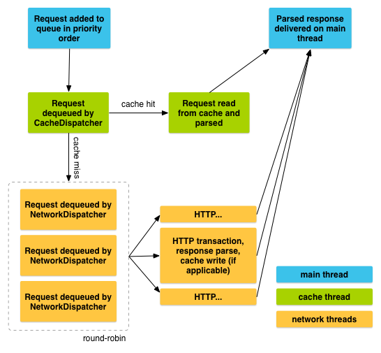

# Send a simple request

At a high level, you use Volley by creating a `RequestQueue` and passing it
`Request` objects. The `RequestQueue` manages worker threads for running the
network operations, reading from and writing to the cache, and parsing responses. Requests
do the parsing of raw responses and Volley takes care of dispatching the parsed response
back to the main thread for delivery.

This lesson describes how to send a request using the `Volley.newRequestQueue`
convenience method, which sets up a `RequestQueue` for you.
See the next lesson, [Setting Up a RequestQueue](./requestqueue.md), for information on how to set
up a `RequestQueue` yourself.

This lesson also describes how to add a request to a `RequestQueue` and cancel a
request.

## Add the INTERNET permission

To use Volley, you must add the
[`android.permission.INTERNET`](https://developer.android.com/reference/android/Manifest.permission#INTERNET)
permission to your app's manifest. Without this, your app won't be able to connect to the network.

## Use newRequestQueue

Volley provides a convenience method `Volley.newRequestQueue` that sets up a
`RequestQueue` for you, using default values, and starts the queue. For example:

*Kotlin*

```kotlin
val textView = findViewById<TextView>(R.id.text)
// ...

// Instantiate the RequestQueue.
val queue = Volley.newRequestQueue(this)
val url = "https://www.google.com"

// Request a string response from the provided URL.
val stringRequest = StringRequest(Request.Method.GET, url,
        Response.Listener<String> { response ->
            // Display the first 500 characters of the response string.
            textView.text = "Response is: ${response.substring(0, 500)}"
        },
        Response.ErrorListener { textView.text = "That didn't work!" })

// Add the request to the RequestQueue.
queue.add(stringRequest)
```

*Java*

```java
final TextView textView = (TextView) findViewById(R.id.text);
// ...

// Instantiate the RequestQueue.
RequestQueue queue = Volley.newRequestQueue(this);
String url = "https://www.google.com";

// Request a string response from the provided URL.
StringRequest stringRequest = new StringRequest(Request.Method.GET, url,
            new Response.Listener<String>() {
    @Override
    public void onResponse(String response) {
        // Display the first 500 characters of the response string.
        textView.setText("Response is: " + response.substring(0,500));
    }
}, new Response.ErrorListener() {
    @Override
    public void onErrorResponse(VolleyError error) {
        textView.setText("That didn't work!");
    }
});

// Add the request to the RequestQueue.
queue.add(stringRequest);
```

Volley always delivers parsed responses on the main thread. Running on the main thread
is convenient for populating UI controls with received data, as you can freely modify UI
controls directly from your response handler, but it's especially critical to many of the
important semantics provided by the library, particularly related to canceling requests.

See [Setting Up a RequestQueue](requestqueue.md) for a
description of how to set up a `RequestQueue` yourself, instead of using the
`Volley.newRequestQueue` convenience method.

## Send a request

To send a request, you simply construct one and add it to the `RequestQueue` with
`add()`, as shown above. Once you add the request it moves through the pipeline,
gets serviced, and has its raw response parsed and delivered.

When you call `add()`, Volley runs one cache processing thread and a pool of
network dispatch threads. When you add a request to the queue, it is picked up by the cache
thread and triaged: if the request can be serviced from cache, the cached response is
parsed on the cache thread and the parsed response is delivered on the main thread. If the
request cannot be serviced from cache, it is placed on the network queue. The first
available network thread takes the request from the queue, performs the HTTP transaction,
parses the response on the worker thread, writes the response to cache, and posts the parsed
response back to the main thread for delivery.

Note that expensive operations like blocking I/O and parsing/decoding are done on worker
threads. You can add a request from any thread, but responses are always delivered on the
main thread.

This figure illustrates the life of a request:



## Cancel a request

To cancel a request, call `cancel()` on your `Request` object. Once cancelled,
Volley guarantees that your response handler will never be called. What this means in
practice is that you can cancel all of your pending requests in your activity's
[`onStop()`](https://developer.android.com/reference/android/app/Activity#onStop())
method and you don't have to litter your response handlers with checks for `getActivity() == null`,
whether `onSaveInstanceState()` has been called already, or other defensive
boilerplate.

To take advantage of this behavior, you would typically have to
track all in-flight requests in order to be able to cancel them at the
appropriate time. There is an easier way: you can associate a tag object with each
request. You can then use this tag to provide a scope of requests to cancel. For
example, you can tag all of your requests with the 
[`Activity`](https://developer.android.com/reference/android/app/Activity)
they are being made on behalf of, and call `requestQueue.cancelAll(this)` from
[`onStop()`](https://developer.android.com/reference/android/app/Activity#onStop()).
Similarly, you could tag all thumbnail image requests in a
[`ViewPager`](https://developer.android.com/reference/androidx/viewpager/widget/ViewPager)
tab with their respective tabs and cancel on swipe
to make sure that the new tab isn't being held up by requests from another one.

Here is an example that uses a string value for the tag:

1. Define your tag and add it to your requests.
   
    *Kotlin*

    ```kotlin
    val TAG = "MyTag"
    val stringRequest: StringRequest // Assume this exists.
    val requestQueue: RequestQueue? // Assume this exists.
    
    // Set the tag on the request.
    stringRequest.tag = TAG
    
    // Add the request to the RequestQueue.
    requestQueue?.add(stringRequest)
    ```

    *Java*

    ```java
    public static final String TAG = "MyTag";
    StringRequest stringRequest; // Assume this exists.
    RequestQueue requestQueue;  // Assume this exists.
    
    // Set the tag on the request.
    stringRequest.setTag(TAG);
    
    // Add the request to the RequestQueue.
    requestQueue.add(stringRequest);
    ```

2. In your activity's [`onStop()`](https://developer.android.com/reference/android/app/Activity#onStop())
   method, cancel all requests that have this tag.

   *Kotlin*

   ```kotlin
   protected fun onStop() {
       super.onStop()
       requestQueue?.cancelAll(TAG)
   }
   ```

   *Java*

   ```java
   @Override
   protected void onStop() {
       super.onStop();
       if (requestQueue != null) {
           requestQueue.cancelAll(TAG);
       }
   }
   ```

Take care when canceling requests. If you are depending on your response handler to
advance a state or kick off another process, you need to account for this. Again, the
response handler will not be called.
